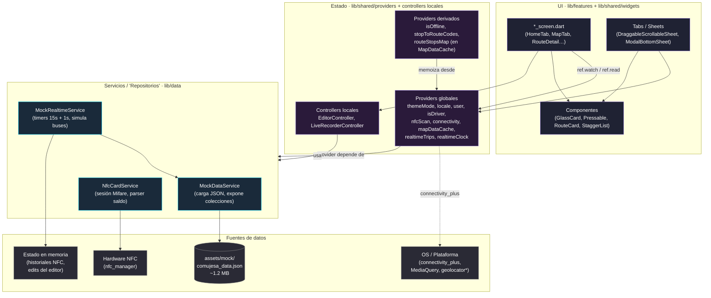

# Arquitectura — Transitly

> **Propósito de este documento.** Fijar las decisiones estructurales del proyecto antes de tocar más código: cómo se organizan las carpetas, cómo fluye el estado entre capas, qué entidades de dominio existen hoy y cuáles vamos a añadir, y cómo se manejan errores y logs. Lectura obligatoria antes de empezar cualquier feature nueva.
>
> **Estado del documento:** vivo. Si una decisión cambia, se actualiza aquí — no se documenta en commit messages.
>
> **Última auditoría que respalda este doc:** ver `C:\Users\k\.claude\plans\quiero-que-me-hagas-reflective-hummingbird.md` (post P43, commit `b91fc25`).

---

## 1. Convención de carpetas

**Adoptamos `feature-first` con `core/` + `shared/` + `data/` como cross-cutting.** Es lo que ya existe — cada feature (home, driver, route_detail, …) vive en su propia carpeta autocontenida con screens, widgets y controladores; los conceptos transversales (router, theme, modelos compartidos, widgets reutilizables, servicios de datos) se aíslan fuera. Encaja con cómo crece la app: cada nueva pantalla aterriza en una carpeta de feature, y los pocos elementos verdaderamente compartidos quedan en `shared/`.

```
lib/
├── app.dart               # MaterialApp.router
├── main.dart              # bootstrap (carga mock, ProviderScope)
├── core/                  # Cross-cutting: router, theme, utils. NO lógica de negocio.
│   ├── router/            # go_router, redirects
│   ├── theme/             # design tokens (colors, typography, spacing, animations)
│   └── utils/             # logger, helpers genéricos
├── data/                  # Capa de datos: servicios + fuentes
│   ├── mock/              # MockDataService, MockRealtimeService
│   └── nfc/               # NfcCardService + l10n de errores
├── features/              # UNA carpeta por dominio funcional
│   ├── <feature>/
│   │   ├── *_screen.dart      # punto de entrada navegable
│   │   ├── steps/             # sub-pantallas tipo wizard (opcional)
│   │   ├── widgets/           # piezas internas, NO compartidas
│   │   └── *_controller.dart  # estado local (Notifier / ChangeNotifier) si aplica
│   └── …
├── l10n/                  # ARB sources + generated
└── shared/                # Reutilizable transversal
    ├── models/            # entidades de dominio (plain Dart)
    ├── providers/         # estado global Riverpod
    └── widgets/           # tokens UI compuestos (Pressable, GlassCard, RouteCard…)
```

**Reglas de oro de la convención:**

1. **Una pantalla = un archivo `*_screen.dart` dentro de su feature.** Si pasa de ~300 LoC, se descompone en `widgets/` o `steps/` *de la misma feature*, no en `shared/`.
2. **`shared/widgets/` solo si se usa en ≥ 2 features.** Si solo lo usa una feature, vive dentro de esa feature.
3. **`shared/providers/` solo para estado global.** Estado local de pantalla → `*_controller.dart` en la propia feature, o `useState`-equivalent vía `StatefulWidget` / `setState`.
4. **`data/` no depende de `features/`.** Es la capa más profunda; solo la usa Riverpod desde `shared/providers/` o controladores locales.
5. **Tokens de diseño se consumen, no se duplican.** `transit_colors`, `transit_typography`, `transit_spacing`, `transit_animations` son la fuente de verdad.

---

## 2. Diagrama de capas



> **Nota sobre la palabra "repositorio".** Hoy no hay un patrón Repository formal — `MockDataService` cumple ese rol porque la fuente de verdad es un único JSON estático. Si en el futuro entran APIs reales, cada repositorio (`RouteRepository`, `StopRepository`, …) vivirá en `lib/data/<dominio>/` y los providers globales pasarán a depender de la abstracción, no del servicio mock.
>
> *El asterisco en `geolocator` indica dependencia futura: hoy el `LiveRecorderController` usa un `gpsSimulatedPath` hardcoded, no GPS real.*

---

## 3. Entidades de dominio

Lo que ya existe en `lib/shared/models/` y lo que vamos a añadir. Marcado `✅` lo que tiene clase Dart hoy, `🟨` lo que existe parcialmente / embebido en otro modelo, `⬜` lo que aún no.

| Entidad | Estado | Modelo / origen | Notas |
|---------|--------|-----------------|-------|
| **User** | ✅ | `UserModel` (`user_model.dart`) | `id`, `name`, `email`, `roles` (List\<String\>), `driverOperatorIds`, `primaryZoneId`, `reputationScore`, `reputationLevel` |
| **Role** | 🟨 | embebido en `UserModel.roles` | Hoy son strings (`passenger`, `driver`, `admin`). Pendiente: extraer a `enum UserRole` con permisos asociados |
| **Route — oficial** | ✅ | `RouteModel` (`route_model.dart`) | `status: RouteStatus.official`, `operatorId` apuntando a COMUJESA |
| **Route — comunitaria** | 🟨 | mismo `RouteModel`, distinguible por `status` ∈ {`draft`, `pendingVerification`, `verified`, `suspended`} | Conviven en la misma colección. Pendiente: diferenciar `source: RouteSource.{official,community}` (campo nuevo) para no usar `status` como dual marker |
| **Stop** | ✅ | `StopModel` (`stop_model.dart`) | 598 paradas geocodificadas reales |
| **Schedule** | ✅ | `ScheduleModel` (`schedule_model.dart`) | `dayType` ∈ {weekday, saturday, sunday/holiday}, `direction`, lista de `daysOfWeek` |
| **BusLocation** | 🟨 | embebido en `ActiveTripModel.currentLat/currentLng/bearing` | Pendiente: extraer a value-object `BusLocation { lat, lng, bearing, recordedAt }` para que sirva tanto a `ActiveTripModel` como a futuros telemetry events |
| **Report** | ✅ | `IncidentModel` + `RouteFeedbackModel` | Dos sabores: `IncidentModel` (problemas en parada/línea: retraso, no presentado, congestión) y `RouteFeedbackModel` (correcciones de información: cambio de parada, error de horario) |
| **Suggestion** | ✅ | `RouteSuggestionModel` | Propuesta de nueva ruta (origen, destino, motivación, votos) |
| **FeatureRequest** | ⬜ | — | **No existe.** Pendiente: modelo dedicado (separar de `Suggestion`, que es siempre de rutas). Campos previstos: `id`, `title`, `description`, `submittedBy`, `category`, `priority`, `status`, `votes`, `createdAt` |
| **Theme** | 🟨 | `ThemeMode` (Flutter SDK) + `themeModeProvider` | Hoy es solo el toggle light/dark/system. Pendiente: si quisiéramos temas custom (`AccessibleHighContrast`, marcas blancas), envolver en `enum AppTheme` propio |
| **OfflineRegion** | ⬜ | — | **No existe.** `OfflineDataScreen` solo expone metadatos del asset. Pendiente: modelo `OfflineRegion { id, label, bounds, downloadedAt, sizeBytes, status }` para cuando descarguemos tiles del mapa offline |

### Modelos auxiliares ya presentes (no entran en la lista anterior pero conviene anotar)

`OperatorModel`, `RouteStopModel`, `ActiveTripModel`, `AlertModel`, `RouteChangelogModel`, `ZoneModel`, `UserCardModel`, `UserFavoriteModel`, `HabitualTripModel`, `TripHistoryModel`, `AchievementModel`, `UserAchievementModel`, `FeedbackMessageModel`. Todos son **plain-Dart** con `factory fromJson`. **Pendiente arquitectónico:** evaluar migración a `freezed` cuando el grafo crezca lo suficiente para que la igualdad por valor importe (rebuilds de Riverpod). Hoy no es prioridad.

---

## 4. Política de errores

### 4.1 Principios

1. **Errores tipados en los bordes, mensajes localizados en la UI.** Cada servicio que pueda fallar declara un `enum *Error` y lanza una excepción tipada. La capa de UI traduce ese enum a una cadena via `AppLocalizations`. *Ejemplo de referencia:* `NfcCardError` + `NfcCardException` + extensión `NfcCardErrorL10n.localizedMessage(l10n)` en `lib/data/nfc/nfc_l10n.dart`.
2. **Nada de `catch (_) {}` silenciosos.** Si no se puede manejar, se propaga; si se decide ignorar, queda `catch (e) { logger.warn('contexto', e); }` para que quede traza.
3. **Validación en el boundary, confianza en el interior.** Validamos donde entran datos externos (NFC tag, JSON parse, navegación con `:routeId`/`:stopId` inválidos) y dejamos de validar en cada función interna.
4. **No usamos excepciones para flujo de control.** Si una operación normalmente devuelve "no encontrado", se modela con `null` o un `Result`-equivalent; las excepciones son para fallos genuinos.
5. **Errores de red ≠ errores de aplicación.** Conectividad la observamos vía `isOfflineProvider` y mostramos UI específica (banner offline en MapTab). No se lanza excepción por estar sin red.

### 4.2 Comportamiento por capa

| Capa | Qué hace ante un error |
|------|------------------------|
| **Servicio (`data/`)** | Lanza una excepción tipada (`NfcCardException`, `MockDataException`*, …) o devuelve `null`/`Result.failure`. Logea siempre con contexto. |
| **Provider (`shared/providers/`)** | Captura, registra el error en su `state` (ej. `NfcScanState.errorKind`). Nunca relanza al widget. |
| **Widget** | Lee el estado de error del provider, lo traduce con `AppLocalizations`, y ofrece acción de recuperación (reintentar, volver). |
| **Router (`core/router/`)** | `redirect` en rutas paramétricas valida y deriva a `/home/inicio` si el ID no existe. `errorBuilder` global → `NotFoundScreen`. |

*`MockDataException` aún no existe; hoy `MockDataService.init()` propaga lo que devuelva `rootBundle`. Pendiente: envolver para que un JSON corrupto produzca un error tipado en lugar de un `FormatException` crudo.*

### 4.3 Errores conocidos y plantilla

```dart
// Template para nuevos servicios
enum FooError { notFound, malformed, networkUnavailable, unknown }

class FooException implements Exception {
  const FooException(this.error, [this.message]);
  final FooError error;
  final String? message;
}

// En la UI
extension FooErrorL10n on FooError {
  String localizedMessage(AppLocalizations l10n, {String? fallback}) {
    return switch (this) {
      FooError.notFound       => l10n.fooErrorNotFound,
      FooError.malformed      => l10n.fooErrorMalformed,
      FooError.networkUnavailable => l10n.fooErrorOffline,
      FooError.unknown        => fallback ?? l10n.fooErrorUnknown,
    };
  }
}
```

---

## 5. Política de logging

### 5.1 Punto único: `AppLogger`

Todo el logging pasa por `lib/core/utils/app_logger.dart` (wrapper sobre `debugPrint` + `assert`, sin dependencias). Esto nos permite:

- Migrar al paquete `logger` cuando haga falta sin tocar callsites.
- Anular logs en tests (`AppLogger` respeta `kReleaseMode`).
- Filtrar por nivel (`debug`, `info`, `warn`, `error`).

### 5.2 Niveles y cuándo usarlos

| Nivel | Uso | Ejemplos |
|-------|-----|----------|
| `debug` | Trazas de desarrollo, ruido aceptable. Solo en `kDebugMode`. | "Cache hit para routeId=L1", "tick realtime t=12345" |
| `info` | Hitos del ciclo de vida del usuario. | Inicio de sesión NFC, cambio de tema, locale modificado |
| `warn` | Algo raro pero no fatal. La app sigue. | Tile del mapa devuelve 429, JSON tiene un campo inesperado, NFC recibe tag no soportado |
| `error` | Fallo que rompió un flujo del usuario. Persistible (futuro: Sentry). | `NfcCardError.authFailed`, `MockDataException.malformed`, deeplink a ruta inexistente que llegó al `errorBuilder` |

### 5.3 Reglas

1. **PII fuera del log.** Nunca: número de tarjeta, lat/lng exactos del usuario, email, NFC UID. Sí está OK loguear `routeId`, `stopId`, `error.runtimeType`, contadores.
2. **Una línea por evento, con tag.** Formato `[Servicio] mensaje (key=value, key2=value2)`. Ejemplo: `[NfcCardService] read failed (sector=9, error=authFailed)`.
3. **Errores: log + propagar / log + estado**. Nunca solo `print`; siempre con `AppLogger.error('[Servicio] contexto', e, stackTrace)`.
4. **Sin `print` en `lib/`.** Lint `avoid_print` activo desde P37. Tests pueden usar `print` — vive solo en `test/`.
5. **Logs no son métricas.** Para contadores (cuántas veces se escaneó NFC con éxito/error), un día tendremos un `analytics_provider.dart`. Hoy no.

### 5.4 Convenciones de tag por capa

- **Servicios:** `[NfcCardService]`, `[MockDataService]`, `[MockRealtimeService]`.
- **Providers:** `[Provider:nfcScan]`, `[Provider:realtimeTrips]`.
- **Router:** `[Router]` para redirects y errores de navegación.
- **Features:** raramente loguean directamente — si lo hacen, `[Feature:<nombre>]`.

---

## 6. Apéndice — Tokens y patrones que ya están escritos

> Se documentan aquí para que nadie los re-implemente. Si un widget nuevo necesita uno de estos comportamientos, lo importa, no lo recrea.

### 6.1 Diseño

| Token | Archivo | Qué expone |
|-------|---------|-----------|
| Colores | `lib/core/theme/transit_colors.dart` | `TransitColorScheme.of(isDark)` → `bgRoot`, `bgSurface`, `bgRaised`, `accent`, `textHi/Mid/Lo`, `border`, `state*`, gradientes |
| Tipografía | `lib/core/theme/transit_typography.dart` | `headingHero`, `sectionTitle`, `bodyPrimary/Secondary/Small`, `numericValue` |
| Espaciado | `lib/core/theme/transit_spacing.dart` | Escala `space2…64`, `radiusXs…XL`, `paddingScreen/Card/Section/Badge`, `strokeThin/Regular` |
| Animación | `lib/core/theme/transit_animations.dart` | Duraciones (`flash`/`fast`/`normal`/`slow`/`feedback`), curvas (`transitEaseOut`/`transitEaseInOut`), helpers (`shouldAnimate`, `adaptiveDuration`) |

### 6.2 Widgets compartidos

`Pressable` (escala + opacidad), `GlassCard` (fondo translúcido), `StaggerList` (entrada en cascada), `RouteCard`, `ReputationBadge`, `StatusBadge`, `TransitButton`, `SmokeBackground`, `GradientText`, `SingleFieldDialog`, `SmokeBackground`, `ResponsiveScaffold` (rail vs bottomNav).

### 6.3 Helpers y patrones de Riverpod

- `isDarkMode(ref, context)` → unifica lectura de tema (`themeModeProvider` + `MediaQuery.platformBrightnessOf`).
- `routerInitialLocationProvider` → punto de override para tests (saltar splash).
- `mapDataCacheProvider` → memoiza estructuras derivadas pesadas; **patrón a replicar** para cualquier cómputo O(n²) sobre las colecciones del JSON.
- `stopToRouteCodesProvider` → ejemplo de inverted index derivado.

---

## 7. Cómo evolucionar este documento

1. **Antes de empezar una feature nueva**, abre este doc y comprueba que sus piezas (entidades, providers, servicios, errores) están descritas. Si no, añádelas en estado `⬜` con una nota.
2. **Cuando merges una feature**, mueve sus entidades / errores de `⬜` a `🟨` o `✅` y actualiza el diagrama si introduces una nueva capa o dependencia.
3. **No documentar pseudo-decisiones.** Si algo no está decidido todavía, queda como pregunta abierta al final, no como sección.

---

**Última actualización:** 2026-04-29 · post auditoría P43.
