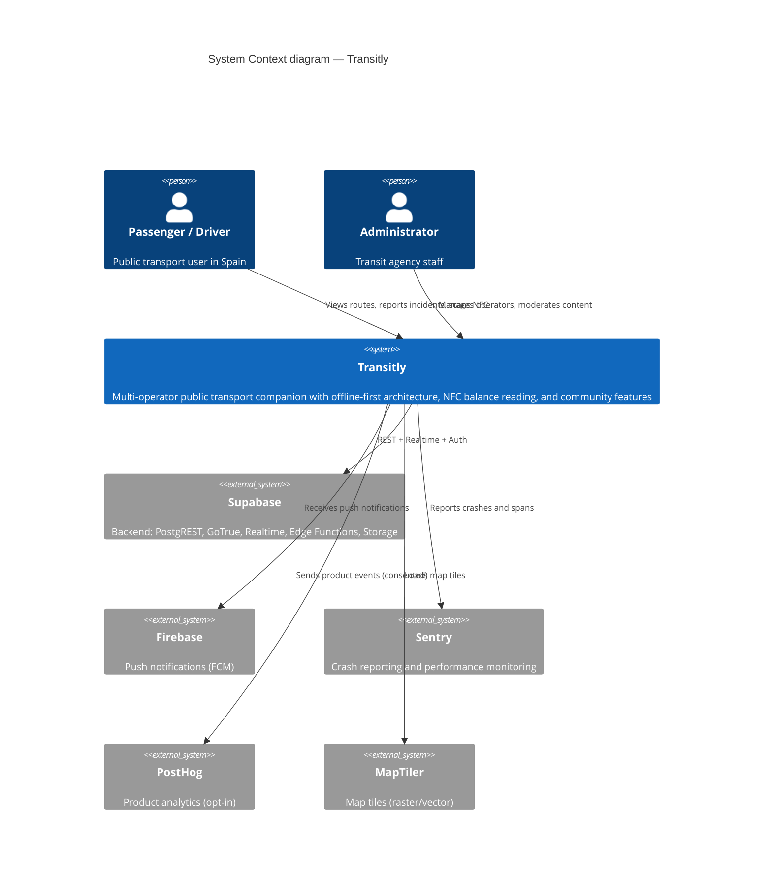
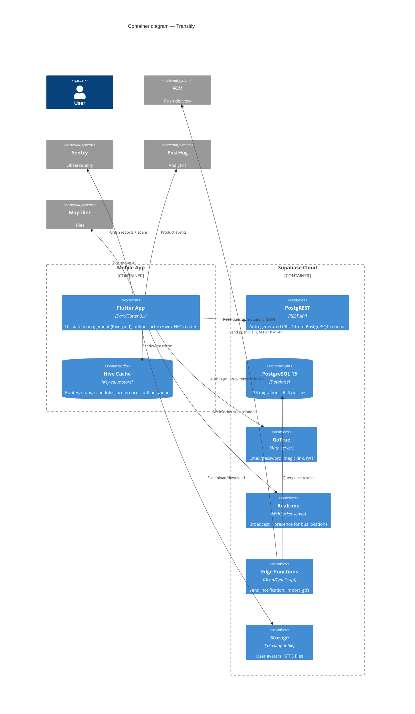
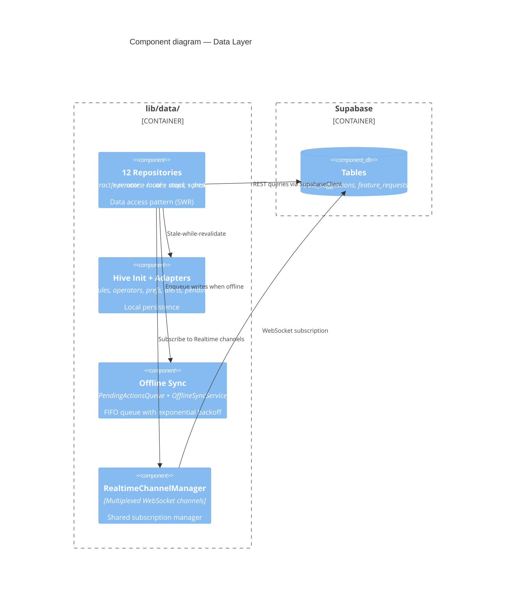

# C4 Diagrams — Transitly

> **Version:** 1.0 · **Notation:** C4 Model (https://c4model.com)

---

## C4-1: System Context



---

## C4-2: Container Diagram



---

## C4-3: Component Diagram (Data Layer)



---

## C4-4: Component Diagram (Features)

```mermaid
C4Component
    title Component diagram — Features

    Container_Boundary(features, "lib/features/") {
        Component(home, "Home", "HomeTab, SearchTab, ProfileTab")
        Component(map, "Map", "MapTab, map filters, route polylines")
        Component(auth, "Auth", "Sign in, sign up, magic link, recover")
        Component(driver, "Driver", "Dashboard, live tracking, start route")
        Component(community, "Community", "Incidents, suggestions, feedback, voting")
        Component(admin, "Admin", "Operator CRUD, moderator inbox, user management")
        Component(nfc, "NFC", "Card scan, balance read")
        Component(editor, "Editor", "Community route wizard")
        Component(profile, "Profile", "Settings, accessibility, privacy")
    }

    Container_Boundary(shared, "lib/shared/") {
        Component(providers, "Global Providers", "Riverpod: theme, locale, user, NFC, connectivity")
        Component(models, "Models", "@freezed: Route, Stop, User, Incident, etc.")
        Component(widgets, "Shared Widgets", "Pressable, GlassCard, TransitButton, StaggerList, ...")
    }

    Rel(home, providers, "ref.watch")
    Rel(map, providers, "ref.watch")
    Rel(admin, providers, "ref.read")
    Rel(community, providers, "ref.watch")

    Rel(providers, repos, "Data access")
```

---

## Legend

| Symbol | Meaning |
|--------|---------|
| `C4Context` | System context (users + external systems) |
| `C4Container` | Deployable units (app, database, edge functions) |
| `C4Component` | Logical components (repositories, providers, features) |
