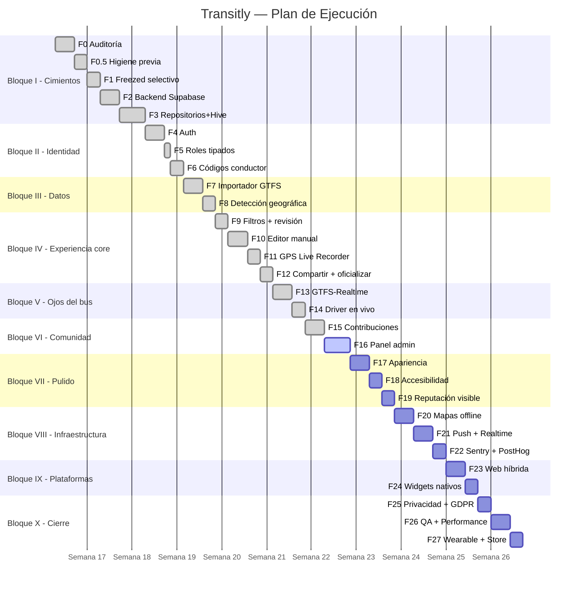

# 03 — Planificación de la Ejecución

**Proyecto:** Transitly
**Fecha:** 2026-05-14

---

## 1. Diagrama de Gantt

---

## 2. Asignación de recursos

| Recurso | Detalle |
|---------|---------|
| **Desarrollador** | 1 persona (full-stack Flutter + Supabase) |
| **Entorno** | Windows 11, VS Code, Android Studio |
| **Dispositivos test** | Android físico (API 24+), emulador iOS |
| **Servicios cloud** | Supabase (free tier), GitHub (repo) |
| **Herramientas IA** | OpenCode con sistema multiagente (Queen + Developer + Review + Git + Docs) |

---

## 3. Evaluación de riesgos

| Riesgo | Probabilidad | Impacto | Contingencia |
|--------|:---:|:---:|------|
| Supabase downtime | Baja | Alto | Caché Hive local + modo invitado mock |
| Cambios en API GTFS de operadores | Media | Medio | Edge Function de importación con validación |
| Incompatibilidad Flutter al actualizar | Baja | Medio | Pin de versiones en pubspec.yaml |
| Retraso acumulado por fases largas | Media | Alto | Fases atómicas de 1-3 días; plan flexible |
| Falta de testers reales | Alta | Bajo | Mock data simula usuarios; beta cerrada en F26 |

---

## 4. Entregables parciales

| Entrega | Fase | Fecha estimada | Contenido |
|---------|------|---------------|-----------|
| E1 — MVP backend | F3 | 2026-05-06 | Supabase operativo, repositorios, caché |
| E2 — MVP funcional | F14 | 2026-05-12 | App usable: auth, mapa, tracking, contribuciones |
| E3 — Versión completa | F22 | 2026-05-20 | Offline, push, monitoring, accesibilidad |
| E4 — Release candidate | F27 | 2026-05-25 | GDPR, QA, Play Store ready |

---

**Última actualización:** 2026-05-14 · Documentation Agent
