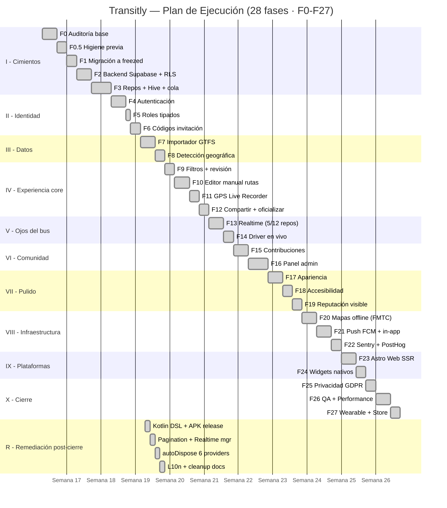

# 03 — Planificación de la Ejecución

**Proyecto:** Transitly
**Estado actual:** 28/28 fases completadas (F0 → F27) · `master @ 3a31fb3`
**Metodología:** desarrollo ágil incremental por fases atómicas de 1-4 días, con verificación al cierre (`flutter analyze` 0, `flutter test` verde, commit + push)

---

## 1. Diagrama de Gantt

Duración total: **~28 días naturales** desde F0 (2026-04-28) hasta F27
(2026-05-25). Trabajo post-cierre (Workstream R, ciclos de remediación
documentados en el plan vivo `docs/MEGA_PLAN_REFINAMIENTO.md`) extendió
hasta 2026-05-20 con mejoras de calidad (Kotlin DSL fix, Realtime
multiplex, autoDispose, l10n trilingüe, etc.).

---

## 2. Secuencia de tareas y plazos

### 2.1. Reglas de secuenciación

1. **Ninguna fase comienza sin que la anterior cierre verde**
   (`flutter analyze` 0 + `flutter test` 100 % verde).
2. **Las fases son atómicas** (1–4 días). Si una fase se desborda, se
   parte en sub-fases (p.ej. `F3.1`, `F3.2`).
3. **Cierre = commit semántico + push a `master`** (sin ramas).
4. **Tras el cierre formal (F27), entran ciclos de remediación** sobre
   el plan vivo `docs/MEGA_PLAN_REFINAMIENTO.md` (Workstream R, P0-P3,
   PROD, A11Y) — son sprints de "última milla" para producción real.

### 2.2. Tabla resumen por bloque

| Bloque | Fases | Duración (días) | Producto entregado |
|--------|-------|:---:|---------------------|
| I. Cimientos | F0 – F3 | 14 | Backend Supabase operativo + repos canónicos + caché Hive |
| II. Identidad | F4 – F6 | 6 | Auth + roles + códigos de conductor |
| III. Datos | F7 – F8 | 5 | Importador GTFS + 10 operadores españoles detectados |
| IV. Experiencia core | F9 – F12 | 9 | Mapa, editor de rutas, GPS, compartir |
| V. Ojos del bus | F13 – F14 | 5 | Realtime real en 5 repos + driver en vivo |
| VI. Comunidad | F15 – F16 | 7 | Incidencias + votos + panel admin |
| VII. Pulido | F17 – F19 | 7 | Apariencia + accesibilidad + reputación |
| VIII. Infraestructura | F20 – F22 | 8 | Mapas offline + push + telemetría |
| IX. Plataformas | F23 – F24 | 5 | Astro Web + widgets nativos |
| X. Cierre | F25 – F27 | 7 | GDPR + QA + publicación |
| **Total** | F0 – F27 | **~28 días naturales** | App funcional y CI verde |

---

## 3. Asignación de recursos

### 3.1. Recursos humanos

| Rol | Persona | Dedicación |
|-----|---------|------------|
| Desarrollo | 1 estudiante TFG | Tiempo completo durante 4 semanas |
| Tutoría | Profesor del módulo | Sesiones presenciales + correo |
| **Asistencia IA documentada** | Sistema multiagente OpenCode (Queen, Developer, Review, Git, Documentation) | Por sesión; declarada con transparencia en `multiagent/ARCHITECTURE.md` y en este TFG por integridad académica |

### 3.2. Recursos técnicos

| Recurso | Detalle |
|---------|---------|
| Equipo de desarrollo | Windows 11 / PowerShell + Bash |
| IDE | Visual Studio Code + plugin Flutter/Dart; Android Studio para emulador |
| Dispositivos de prueba | Android físico (API 24+); emulador iOS; navegadores Chrome/Firefox/Safari para web |
| VCS | Git + GitHub (repositorio privado de TFG con CI activado) |
| Servicios cloud | Supabase (plan free), MapTiler (plan free), Firebase (plan free), Sentry (plan free), PostHog (plan free) |
| Tracker | GitHub Issues + plan vivo `docs/MEGA_PLAN_REFINAMIENTO.md` + `multiagent/state/queue.json` |

### 3.3. Costes (resumen, detalle en `02_diseno_proyecto.md §5.2`)

- MVP actual: **~25 €** (única cuota Google Play).
- Escalado a 10.000 usuarios mensuales activos: **~150–200 €/mes**
  (Supabase Pro + MapTiler + Sentry + Apple Developer).

---

## 4. Evaluación de riesgos y contingencias

### 4.1. Riesgos técnicos

| Riesgo | Probabilidad | Impacto | Plan de contingencia | Estado real |
|--------|:---:|:---:|---------------------|-------------|
| Supabase downtime / cambio de pricing | Baja | Alto | Caché Hive local + modo guest con mocks; los repos auto-seleccionan | ✅ implementado |
| Cambios en API GTFS de operadores | Media | Medio | `import_gtfs` Edge con validación + versionado de feeds | ✅ implementado |
| Incompatibilidad Flutter en upgrade | Baja | Medio | Versiones fijadas en `pubspec.yaml`; CI corre Flutter `3.35.x` | ✅ alineado tras incidencia detectada y resuelta |
| Fallo de codegen freezed | Media | Bajo | `tool/build.sh` reproducible; commit de `.freezed.dart` | ✅ |
| Cola offline crece sin freno | Baja | Medio | Dead-letter tras 10 reintentos; backoff exponencial | ✅ |
| Bug oculto en build Android release | **Media** | **Alto** | (Descubierto en remediación: workmanager v1-embedding, desugaring, Gradle OOM) | ✅ resuelto en ciclo R |

### 4.2. Riesgos de proyecto y negocio

| Riesgo | Probabilidad | Impacto | Plan de contingencia | Estado real |
|--------|:---:|:---:|---------------------|-------------|
| Retraso acumulado por fase larga | Media | Alto | Fases atómicas 1-3 días; partir en sub-fases | ✅ aplicado (F3 partida en F3.1, F3.2, F3.3) |
| Falta de testers reales | Alta | Bajo | Mock data simula usuarios; demo presencial; usuarios simulados con feedback en `tfg/05` | 🟨 mock data sí, beta real no |
| Adopción por conductores | Alta | Alto | UX simplificada para conductor; modo simulado para demo | 🟨 sin conductores reales contratados |
| Datos operadores != COMUJESA | Alta | Bajo | Arquitectura multi-operador; otros 9 documentados pero no poblados | 🟨 declarado como trabajo futuro |
| Cumplimiento GDPR no demostrable | Baja | Alto | Consent-gating real verificado; export + delete operativos | ✅ |

### 4.3. Riesgos de operación a escala (post-MVP)

Recogidos como bloque PROD del plan vivo (`docs/SCALABILITY.md` +
`docs/MEGA_PLAN_REFINAMIENTO.md §PROD`). Resumen:

- Keystore real ausente → APK actual no publicable.
- Observabilidad sin SLO/tracing.
- Mapa sin clustering → no escala a miles de markers.
- Caché Hive sin partición por operador ni cifrado generalizado.

---

## 5. Necesidades logísticas

| Necesidad | Cubierta por |
|-----------|--------------|
| Equipo de desarrollo permanente | Sí (PC del estudiante) |
| Conectividad fiable | Sí (durante sesiones de trabajo) |
| Tarjeta NFC del Consorcio para pruebas | Sí (tarjeta personal del estudiante) |
| Dispositivo Android físico con NFC | Sí (móvil personal del estudiante) |
| Permisos para acceder a feeds GTFS | Sí (datos públicos del operador) |
| Espacio de almacenamiento para coverage / artefactos CI | Sí (GitHub Actions free) |

---

## 6. Entregables parciales

Las fases del plan se agrupan en **4 entregables internos** + el
**entregable final** que cubre todos los productos de la guía TFG:

| Entrega | Fase de cierre | Fecha real | Contenido |
|---------|----------------|------------|-----------|
| **E1** — MVP backend | F3 | 2026-05-06 | Supabase con RLS, repos canónicos, caché Hive, cola offline |
| **E2** — MVP funcional | F14 | 2026-05-12 | App usable: auth, mapa, tracking, contribuciones, modo conductor |
| **E3** — Versión completa | F22 | 2026-05-20 | Offline, push, monitoring, accesibilidad multidimensional |
| **E4** — Release candidate | F27 | 2026-05-25 | GDPR cerrado, QA, APK release que compila (firma con keystore queda como bloqueador) |
| **E-final** — Entregables TFG | post-F27 | 2026-05-20 (este documento) | Memoria + app + manuales + presentación + Gantt + evaluación |

---

## 7. Procedimiento de cierre de fase

Cada cierre de fase exige (criterios verificables):

1. `flutter analyze` → **0 issues**.
2. `flutter test` → **100 % verde**.
3. `git status` → árbol limpio (sin cambios sin commitear).
4. Commit semántico (`feat:`, `fix:`, `docs:`, `refactor:`, etc.) con
   mensaje en imperativo y referencia a la fase.
5. Push a `master` (sin ramas).
6. CI verde para el commit pusheado (4 jobs).
7. `docs/PENDIENTES.md` actualizado si se descubrió deuda nueva.

Si algún criterio falla → la fase no se cierra; se decide si terminarla
o partirla en una sub-fase.

---

## 8. Conclusión de la planificación

Plan ejecutado al 100 % de las 28 fases originales en plazo (~4 semanas).
Tras el cierre formal F27, entraron ciclos de remediación (Workstream R
+ múltiples ciclos P0/P1) que pulieron deuda detectada en revisiones
críticas independientes. El plan vivo de pendientes para llevar el
proyecto a "producción real" (no solo "TFG aprobado") está en
`docs/MEGA_PLAN_REFINAMIENTO.md` con 57 ítems priorizados.
