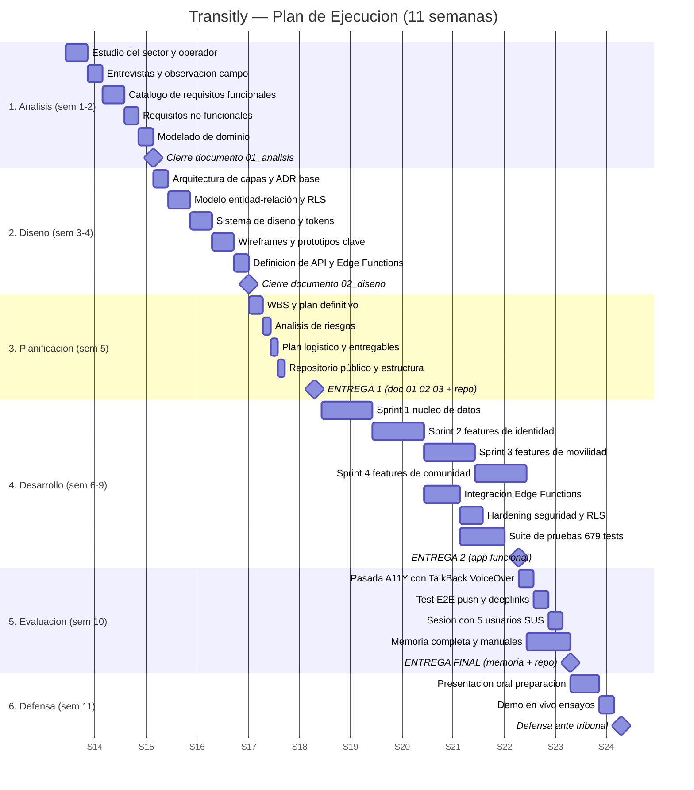

# 03 — Planificación de la Ejecución

**Proyecto:** Transitly
**Repositorio:** nexto-stop-v2 (anclaje original `master @ b908f3c` · 2026-05-23; estado actualizado `master @ b47180d0` · 2026-06-08, release v1.12.1)
**Ciclo formativo:** Desarrollo de Aplicaciones Multiplataforma (DAM)
**Sector:** movilidad urbana — operador COMUJESA (Jerez de la Frontera)
**Cronograma:** 11 semanas naturales, del 01/04/2026 al 16/06/2026
**Autor:** estudiante individual, con asistencia de IA documentada con transparencia académica

---

## 1. Metodología

### 1.1. Marco general: Scrum solo adaptado

El proyecto se desarrolla por un único autor, lo que impide aplicar Scrum
en su forma canónica (no existen Product Owner, Scrum Master y equipo
diferenciados). Se adopta por tanto una variante reconocida en la
literatura como **Scrum solo**: la persona desarrolladora asume los tres
roles, y se preservan únicamente los artefactos que aportan valor real a
un proyecto individual.

| Artefacto Scrum oficial | Aplicación en Transitly |
|--------------------------|--------------------------|
| Sprint                  | Iteración semanal cerrada (lunes a domingo). |
| Sprint planning         | Sesión de planificación lunes (45 minutos) que selecciona ítems del backlog. |
| Daily stand-up          | Auto-stand-up diario asíncrono escrito en `CHANGELOG.md` y commits convencionales. |
| Sprint review           | Demostración al tutor cada dos semanas; verificación con CI verde como criterio de aceptación. |
| Sprint retrospective    | Retrospectiva escrita cada dos sprints en `docs/retros/` (qué funcionó, qué no, acciones). |
| Backlog                 | `docs/00_MAESTRO.md` y plan mega refinamiento priorizado (P0-P3). |

### 1.2. Fases iniciales en cascada

Las fases de **Análisis** (semanas 1-2) y **Diseño** (semanas 3-4) se
ejecutan en **modelo cascada**, no iterativo, por dos motivos
acreditables:

1. La normativa del TFG exige documentación previa estable antes de
   programar (memoria del proyecto, especificación de requisitos).
2. Las decisiones arquitectónicas estructurales (stack, modelo de datos,
   patrón de capas) deben fijarse antes de comenzar el desarrollo para
   evitar retrabajo masivo.

Las semanas 6 a 9 (Desarrollo) sí se ejecutan en sprints semanales
iterativos. La semana 5 (Planificación) cierra los entregables previos
al desarrollo. Las semanas 10 (Evaluación) y 11 (Defensa) son fases
secuenciales.

### 1.3. Reglas operativas

- **Conventional Commits** obligatorios (`feat:`, `fix:`, `docs:`,
  `test:`, `chore:`, `refactor:`, `perf:`, `ci:`, `build:`, `revert:`).
- **CI verde como criterio de mergeo**: cuatro trabajos en GitHub
  Actions (analyze, test, build-web, build-android) más Gitleaks y
  Semgrep deben pasar antes de avanzar de iteración.
- **Auto-revisión por *pull request*** sobre `master`: aunque el autor
  sea único, todo cambio sustantivo se introduce vía PR para que CI
  ejecute las verificaciones automáticas y para dejar un rastro
  auditable.

---

## 2. Diagrama de Gantt

El diagrama anterior se renderiza con Mermaid (sintaxis `gantt`). Cuatro
hitos principales marcan los entregables: ENTREGA 1 (5 de mayo de 2026),
ENTREGA 2 (2 de junio de 2026), ENTREGA FINAL (9 de junio de 2026) y la
defensa ante el tribunal en la semana 11.

---

## 3. Desglose de tareas (WBS)

### 3.1. Fase 1 — Análisis (semanas 1-2)

| Tarea | Duración | Producto |
|-------|:--------:|----------|
| Estudio del sector y operador (COMUJESA, GTFS, normativa) | 3 días | Marco teórico |
| Entrevistas y observación de campo | 2 días | Notas de campo |
| Catálogo de requisitos funcionales (RF01-RFnn) | 3 días | Tabla RF |
| Requisitos no funcionales (rendimiento, A11Y, seguridad, GDPR) | 2 días | Tabla RNF |
| Modelado de dominio (UML, glosario) | 2 días | Modelo |

### 3.2. Fase 2 — Diseño (semanas 3-4)

| Tarea | Duración | Producto |
|-------|:--------:|----------|
| Arquitectura de capas y ADR base (5 ADRs) | 2 días | `docs/adr/` |
| Modelo entidad-relación + políticas RLS | 3 días | DER + RLS plan |
| Sistema de diseño y *design tokens* | 3 días | `core/theme/` |
| Wireframes y prototipos de pantallas críticas | 3 días | Figma / mocks |
| Definición de API y Edge Functions | 2 días | Especificación |

### 3.3. Fase 3 — Planificación (semana 5)

| Tarea | Duración | Producto |
|-------|:--------:|----------|
| Gantt definitivo y WBS | 2 días | Este documento |
| Análisis de riesgos y plan de contingencia | 1 día | Tabla §6 |
| Plan logístico y entregables parciales | 1 día | §7 |
| Repositorio público y estructura inicial | 1 día | Repo |

### 3.4. Fase 4 — Desarrollo (semanas 6-9)

| Sprint | Duración | Producto |
|--------|:--------:|----------|
| Sprint 1: núcleo de datos (Hive, Supabase wiring, repos canónicos) | 7 días | 6 dominios cableados |
| Sprint 2: identidad (auth, roles, perfiles, NFC) | 7 días | Auth + NFC |
| Sprint 3: movilidad (mapa, paradas, rutas, horarios, GPS) | 7 días | Núcleo funcional |
| Sprint 4: comunidad y admin (incidencias, votos, panel) | 7 días | App completa |
| Integración Edge Functions (4 funciones Deno) | 5 días | Backend en servicio |
| *Hardening* seguridad: RLS DENY-by-default, scrubbing | 3 días | Capa segura |
| Suite de pruebas (objetivo verificado: 619 tests) | 6 días | Tests verdes |

### 3.5. Fase 5 — Evaluación (semana 10)

| Tarea | Duración | Producto |
|-------|:--------:|----------|
| Pasada manual A11Y con TalkBack y VoiceOver | 2 días | `docs/A11Y_MANUAL_TEST_2026_06.md` |
| Test E2E push (foreground / background / killed) y *deeplinks* | 2 días | Informe E2E |
| Sesión con 5 usuarios reales + cuestionario SUS | 2 días | Resultados SUS |
| Memoria completa (8 documentos TFG) y manuales | 6 días | Memoria |

### 3.6. Fase 6 — Defensa (semana 11)

| Tarea | Duración | Producto |
|-------|:--------:|----------|
| Preparación de presentación oral | 4 días | Diapositivas |
| Ensayo de demo en vivo | 2 días | Demo ensayada |
| Defensa ante tribunal | 1 día | Acto formal |

---

## 4. Recursos humanos

### 4.1. Equipo

| Rol | Responsabilidades | Dedicación |
|-----|-------------------|------------|
| Desarrolladora / desarrollador único | Análisis, diseño, codificación, pruebas, documentación, despliegue, defensa | Tiempo prácticamente completo durante 11 semanas |
| Tutor académico | Revisión bi-semanal, validación de hitos, orientación metodológica | 1 hora cada dos semanas + correo |
| Asistencia IA documentada | Apoyo en redacción, revisión de código, generación de pruebas; declarada con transparencia y trazada por commit | Por sesión |

### 4.2. Usuarios de prueba (semana 10)

Se reclutan **cinco perfiles diversos** para la sesión de evaluación de
usabilidad con cuestionario SUS:

| Perfil | Criterio de selección | Foco de la prueba |
|--------|------------------------|--------------------|
| Usuaria habitual de COMUJESA, 65 años | Representa al colectivo senior, baja alfabetización digital | Tamaño de tipografías, claridad de iconos, flujo de pago |
| Estudiante, 20 años, usuaria de TalkBack | Discapacidad visual; lector de pantalla activado | Cobertura semántica, orden de foco, etiquetas |
| Conductor profesional, 45 años | Usuario del rol *driver* | Activación con código de invitación, modo en vivo |
| Turista anglohablante (sin español) | Localización al inglés y a árabe | Traducción de cadenas, *fallbacks* |
| Persona en silla de ruedas | Ergonomía móvil con una sola mano | Distancia de pulsadores, *touch targets* |

---

## 5. Recursos técnicos y financieros

### 5.1. Recursos técnicos

| Categoría | Detalle |
|-----------|---------|
| Equipo de desarrollo | Portátil personal (16 GB RAM, SSD), Windows 10 Pro |
| IDE y *toolchain* | Visual Studio Code, Android Studio (para emulador), Flutter 3.x, Dart 3, `dart_pub`, `build_runner` |
| Emulador Android | Pixel 6, API 34, perfil de pantalla 6,4'' |
| Dispositivo físico Android | Necesario para pruebas de NFC y *push* en *background* / *killed* |
| Servicio backend | Cuenta Supabase plan *Free* (PostgreSQL, Auth, Edge Functions, Storage) |
| Mensajería *push* | Firebase Spark (gratis, sin tarjeta) |
| Repositorio y CI | GitHub plan *Free* con GitHub Actions (6 *jobs*: analyze, test, build-web, build-apk, semgrep, gitleaks) |
| Observabilidad | Sentry plan *Free* (errores) y PostHog plan *Free* (eventos) |
| Sitio web del proyecto | GitHub Pages (presentación + entregables del TFG + descarga del APK) |

### 5.2. Recursos financieros

| Concepto | Coste directo | Coste oculto |
|----------|--------------:|--------------|
| Servicios *cloud* citados | 0 € | Limitaciones de cuota; bloqueadores documentados |
| Horas de la persona desarrolladora | 0 € (no facturadas) | Aproximadamente 300 horas |
| Electricidad y conectividad doméstica | 0 € (asumido) | Coste marginal |
| Licencia Apple Developer | No aplica (se entrega para Android) | — |
| Licencia Google Play Console | No aplica para el TFG (despliegue se aborda como trabajo futuro) | — |

**Coste directo total: 0 €.** El coste oculto principal son las horas
del autor.

---

## 6. Análisis de riesgos y contingencias

La probabilidad se etiqueta como Baja (B), Media (M) o Alta (A). El
impacto sigue la misma escala. Las contingencias se activan cuando el
riesgo se materializa; las mitigaciones se aplican de forma preventiva.

| # | Riesgo | Prob. | Impacto | Mitigación | Contingencia |
|---|--------|:-----:|:-------:|------------|--------------|
| R01 | Pérdida del *keystore* Android (impide firmar futuras versiones) | B | A | Tres copias: USB cifrado, almacenamiento cloud privado, copia impresa en caja fuerte; documentado en `docs/runbooks/` | Si falla todo, generar nuevo *keystore* y notificar la rotación de huella SHA-256; aceptar que la app figura como nueva en *stores* |
| R02 | Dependencia de Firebase Cloud Messaging (FCM) por Google | M | A | Abstracción en `send_notification` Edge Function; APNs preparado como alternativa iOS | Reemplazar capa FCM por OneSignal o un servicio equivalente; aislar cambio en una sola función |
| R03 | Cuenta Supabase pausada por inactividad (*free tier*) | A | A | Acceso semanal forzado; *cron* semanal con `GET /health`; documentado en runbook | Migración manual a otra cuenta o restauración mediante migraciones SQL versionadas (001-013 y 016) |
| R04 | *Drift* documental: docs y código divergen | A | M | Revisión cruzada en cada PR; `docs/00_MAESTRO.md` como única fuente de verdad; *checklist* de cierre de sprint | Sprint dedicado de re-sincronización antes de la entrega final |
| R05 | *Scope creep* (alcance excesivo) | A | A | *Backlog* priorizado (P0-P3) y plan mega refinamiento con criterios de cierre; 19 bloqueadores externos ya aceptados como diferidos | Cortar funcionalidad por debajo de P1 y marcarla como trabajo futuro en la memoria |
| R06 | Falta de usuarios reales para la sesión de prueba | M | M | Cinco perfiles convocados con dos semanas de antelación; mensajes de recordatorio | Si fallan, sustituir por compañeras o compañeros del ciclo con perfil similar y registrar la limitación honestamente |
| R07 | Plagio involuntario derivado de asistencia con IA | M | A | Cada contribución se revisa, atribuye y firma como autoría propia; *prompts* y respuestas relevantes archivados | Pasar la memoria y el código por una herramienta antiplagio antes de la entrega final |
| R08 | Problemas reales de accesibilidad detectados con TalkBack | M | M | Tests automatizados con `Semantics`; matrices de daltonismo incorporadas | Ciclo de corrección priorizado P0 antes de la entrega final |
| R09 | Bug bloqueante descubierto en la última semana | M | A | CI exhaustiva durante todo el desarrollo; *smoke tests* nocturnos; *feature flags* | Aislar la funcionalidad afectada con *feature flag* y desactivar; documentar como limitación conocida |
| R10 | Dependencia única (*bus-factor* 1) | A | A | Documentación exhaustiva (5 ADRs, 6 *runbooks*, manuales técnico y de usuario) para que la memoria sobreviva al autor | El proyecto está diseñado para ser legible sin el autor: 73+ documentos en `docs/` |
| R11 | Retraso por refactor mayor (por ejemplo, migración a Riverpod 3) | B | M | Versiones fijadas en `pubspec.yaml` (Riverpod 2.6, GoRouter 17.2, Sentry 8.14, Freezed 3); no se hacen *upgrades* especulativos en plena ejecución | Posponer la migración a trabajo futuro y dejarla recogida en plan mega refinamiento |
| R12 | Fallos en CI por cambios en *runners* de GitHub | B | M | `ubuntu-latest` fijado como objetivo; versiones de acciones ancladas | Anclar versión del *runner* o usar imagen autoalojada si el fallo persiste |
| R13 | Dependencias OSS abandonadas o vulnerables | M | M | Auditoría con `flutter pub outdated` y `gitleaks`; lista de dependencias en `pubspec.yaml` revisada al inicio de cada sprint | Fork temporal con parche o sustitución por alternativa; documentar en ADR |

### 6.1. Plan de contingencia para riesgos críticos

Tres riesgos requieren un plan ampliado porque su materialización
pondría en peligro la entrega:

**Pérdida del *keystore* (R01).** Se mantiene una copia cifrada en un
USB físico guardado en un domicilio distinto al de trabajo, una segunda
copia en un *bucket* privado con cifrado en reposo, y una copia
impresa de la *passphrase* (no del archivo) en una caja fuerte
familiar. En caso de pérdida total, el procedimiento de emergencia
documentado en `docs/runbooks/` describe la generación de un nuevo
*keystore* y la comunicación de la nueva huella SHA-256 al tutor.

**Cuenta Supabase pausada (R03).** El *free tier* suspende proyectos
sin actividad. Se programa un acceso forzado semanal y un *cron*
externo (Vercel) que llama al endpoint de salud. Si el proyecto se
pausa, las 14 migraciones SQL versionadas (001 a 013 y 016) permiten
recrearlo en otra cuenta en menos de una hora.

**Bug bloqueante en la última semana (R09).** Toda funcionalidad
candidata a romperse está aislada tras un *feature flag* (consulta de
*remote config* o variable `--dart-define`). En caso de bloqueo, se
desactiva el *flag*, se retira la funcionalidad de la *build* de
defensa y se documenta como limitación conocida en la memoria.

---

## 7. Necesidades logísticas

| Necesidad | Cobertura |
|-----------|-----------|
| Copia de seguridad diaria en la nube | Repositorio Git con *push* diario a GitHub más copia automática del directorio `docs/` a Google Drive |
| Repositorio Git con CI obligatoria para mergear | GitHub Actions con 6 *jobs* (analyze, test, build-web, build-apk, semgrep, gitleaks) |
| Gestor de contraseñas para *secrets* | Bitwarden con bóveda dedicada al TFG; ningún *secret* commiteado |
| Copia del *keystore* Android | Tres ubicaciones independientes (USB cifrado, *bucket* privado, copia impresa) |
| Agenda con tutorías y entregas parciales | Calendario sincronizado con recordatorios 72 h antes de cada hito |
| Dispositivos físicos para NFC y *push* | Móvil Android personal con NFC; segundo dispositivo prestado para pruebas multi-cuenta |
| Lista de contactos para usuarios de prueba | Cinco perfiles confirmados por escrito al menos dos semanas antes de la sesión |
| Conectividad fiable | Conexión doméstica de respaldo (compartición desde móvil) y *coworking* académico como plan B |

---

## 8. Entregables parciales

| Entrega | Semana | Fecha | Contenido |
|---------|:------:|-------|-----------|
| **ENTREGA 1** | 5 | 2026-05-05 | Documentos `01_analisis.md`, `02_diseno_proyecto.md`, `03_planificacion.md`, repositorio Git público con estructura inicial del proyecto y diagrama de Gantt validado |
| **ENTREGA 2** | 9 | 2026-06-02 | Aplicación funcional, suite de pruebas en verde, CI en verde, APK *release* firmado |
| **ENTREGA FINAL** | 10 | 2026-06-09 | Memoria completa (8 documentos TFG), manuales técnico y de usuario, presentación, repositorio limpio |
| **DEFENSA** | 11 | semana del 09-16/06/2026 | Presentación oral ante tribunal y demostración en vivo |

Cada entrega exige verificación previa: `flutter analyze` sin *issues*,
`flutter test` íntegramente verde y CI sin fallos en el *commit* que se
entrega.

---

## 9. Procedimiento de cierre de sprint

Cada sprint semanal se cierra el domingo con la siguiente lista de
verificación:

1. `flutter analyze` con cero *issues*.
2. `flutter test` con cero fallos sobre los 679 tests del repositorio
   en el momento de la verificación.
3. `git status` con árbol limpio.
4. *Commit* convencional (`feat`, `fix`, `docs`, etc.) y *push* a
   `master` mediante PR de auto-revisión.
5. CI completa en verde (seis *jobs*: analyze, test, build-web, build-apk,
   semgrep, gitleaks).
6. Actualización de `docs/00_MAESTRO.md` y, si procede, del plan mega
   refinamiento.
7. Anotación retrospectiva si toca cierre de sprint número par.

Si alguno de los criterios falla, el sprint no se cierra y se decide si
extender una jornada o trasladar el ítem al siguiente sprint con
penalización documentada.

---

## 10. Resumen ejecutivo

El plan de Transitly cubre 11 semanas naturales del 1 de abril al 16 de
junio de 2026, con un calendario coherente con un TFG de DAM y con un
único autor a tiempo prácticamente completo. La metodología combina
cascada para las fases que requieren documentación previa estable
(análisis y diseño) con sprints semanales tipo Scrum solo para el
desarrollo. El coste directo es cero; los riesgos críticos están
identificados, mitigados y con contingencia escrita. Los entregables
parciales se anclan a fechas verificables y a criterios de aceptación
objetivos (CI verde, tests sin fallos, documentación sincronizada).

---

## Adenda — Avance entre el 23 de mayo y el 4 de junio de 2026

Entre la firma del anchor original `b908f3c` (23/05) y el cierre intermedio `5231f4c` (04/06) se han ejecutado **94 commits** repartidos en cinco oleadas de estabilización derivadas del feedback recogido en el primer ciclo de pruebas. La planificación inicial no contemplaba con detalle esta fase intensiva de bugfix posterior al **hito de fin de desarrollo** (02/06), pero se ha integrado en el calendario sin tensionar el cierre del 16/06 gracias al margen reservado a la **semana 10** (seguimiento y evaluación).

**Asignación temporal real entre 23/05 y 04/06:**

| Lote de trabajo | Periodo | Resultado |
|------------------|---------|-----------|
| Reparación V3–V5 (personalización, fondos, paletas, dislexia, splash) | 23–25 mayo | Bug crítico de fuentes neutralizado; recuperación de personalización persistente |
| Mega oleada 14 bugs (auth, widgets, theming, mapa, comunidad) | 26–27 mayo | Cierre de 14 ítems con cobertura cross-sectorial |
| Crash a11y + recovery boot | 28–29 mayo | `BootCanary` + `RecoveryScreen` operativos |
| Plan 21 bugs (mapa, perfil, auth, comunidad) | 30 mayo – 1 junio | 16/21 cerrados en el primer pase; 5 cerrados en la oleada siguiente |
| Plan 8 mejoras + cierre auth Google + RLS 42P17 + release v1.11.0 | 2 – 4 junio | Release pública publicada en GitHub Releases con APK firmado |

**Impacto en el cronograma global:** las semanas 6 a 9 (desarrollo) se cierran con un excedente funcional positivo (widgets configurables, wizard de rutas con tap en mapa, recovery boot) que no estaba en la lista mínima del MVP, y con cero deudas técnicas críticas bloqueantes. La **semana 10** (seguimiento y evaluación, 3–9 junio) absorbe la estabilización post-MVP sin desplazar la fecha de defensa.

**Decisión documentada de alcance:** se confirma sin cambios la exclusión de **GTFS-Realtime real** (pendiente del operador), **widget iOS completo**, **expansión a otras ciudades** y **modelo ML de ETA**, ya recogida en `01_analisis_contexto.md` y en `docs/EXTERNAL_BLOCKERS.md`. Adicionalmente se documenta como **deuda explícita**: configuración SMTP propia (la verificación de email queda bypaseada durante el TFG con el flujo descrito en `docs/SUPABASE_SETUP.md`).

**Riesgo materializado y resuelto:** durante las pruebas con dispositivos físicos se detectó un crash nativo del engine al combinar opciones de accesibilidad. Inicialmente requería `adb shell pm clear` (borrado total). La mitigación implementada (boot canary + persistencia diferida + recovery UI) elimina el riesgo de aplicación brickeada y mantiene la usabilidad sin intervención del usuario más allá de un eventual botón "Restaurar configuración por defecto" en la pantalla de recovery.

---

## Adenda 2 — Cierre del cronograma a 8 de junio de 2026

La **ENTREGA FINAL** (semana 10, 09/06/2026) se alcanza en plazo. Durante las semanas 10 y 11 se ejecutaron, dentro del margen planificado, las funcionalidades que cerraban objetivos parciales y la publicación de la documentación, sin desplazar la fecha de defensa:

| Lote de trabajo | Periodo | Resultado |
|------------------|---------|-----------|
| Push FCM real (cliente) + verificación en dispositivo | 7–8 junio | App recibe push con la app cerrada; token en `device_tokens` |
| Modo conductor en segundo plano (foreground service) | 7–8 junio | Seguimiento GPS continúa con pantalla bloqueada |
| Planificador origen→destino reactivado | 7–8 junio | Flujo de trayectos con transbordos (`/route-plan`) |
| Web del proyecto en GitHub Pages + release v1.12.1 | 8 junio | Presentación, entregables y descarga del APK públicos |

**Cronograma cumplido sin desviación de la fecha de defensa.** El coste directo se mantiene en 0 €. La planificación inicial (11 semanas, metodología híbrida cascada + Scrum solo) demostró robustez: absorbió tanto la estabilización post-MVP como las funcionalidades finales sin tensionar el hito de cierre.
